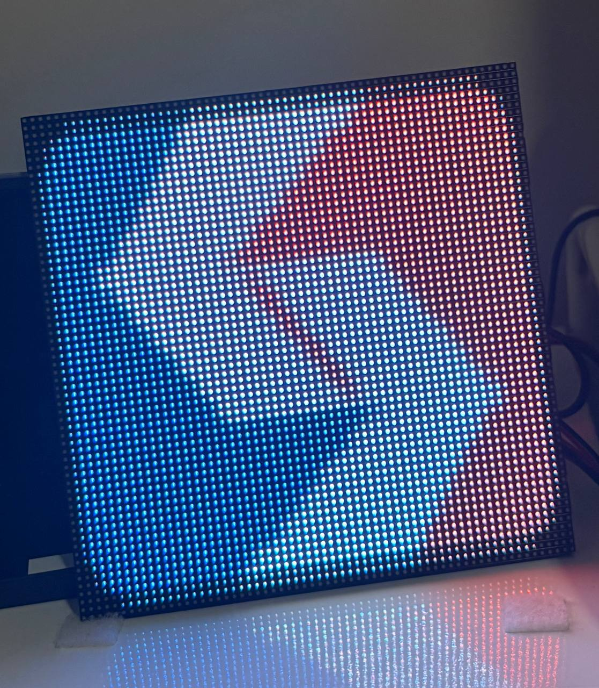
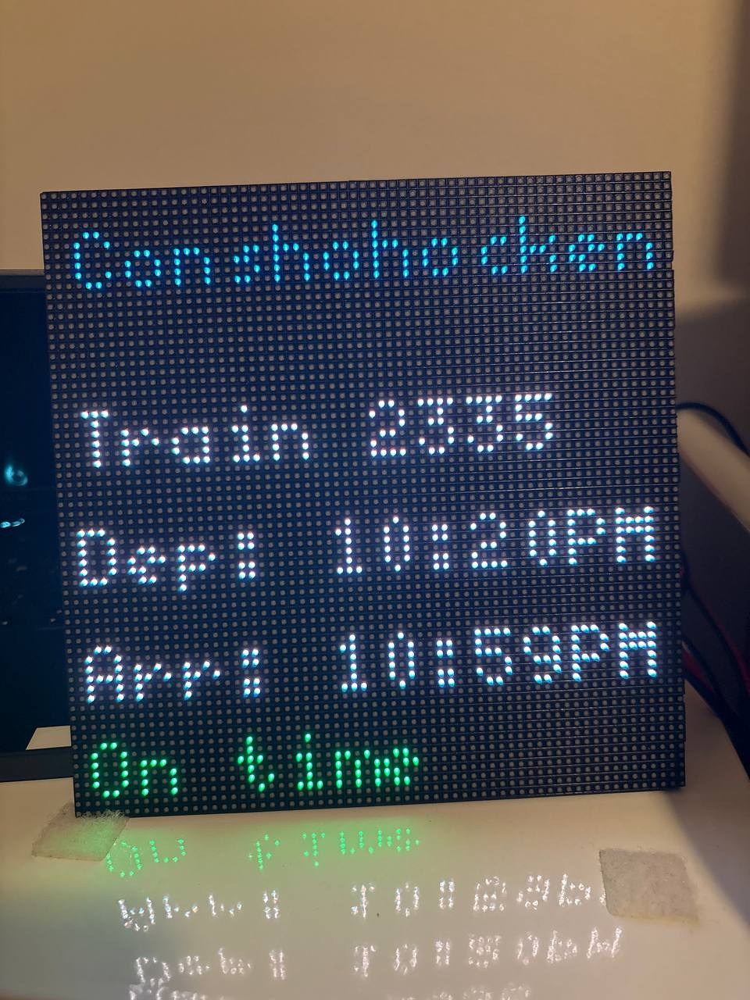
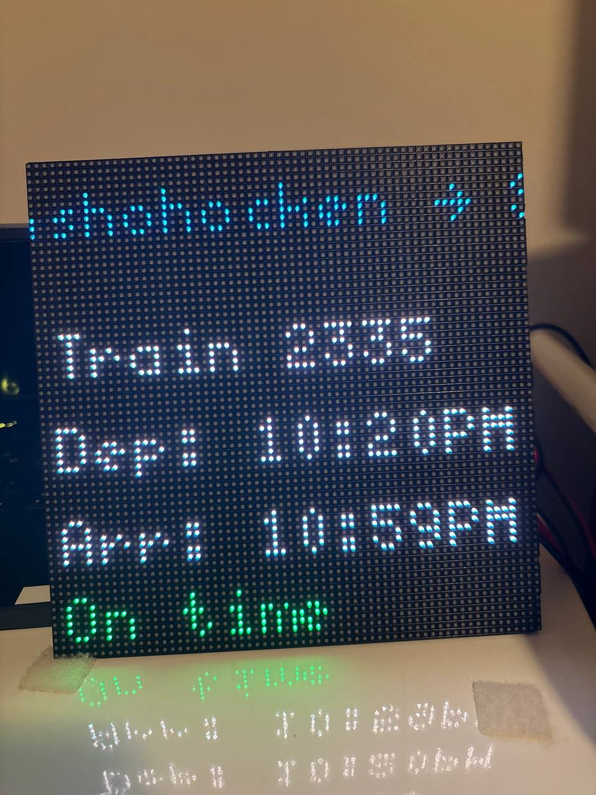
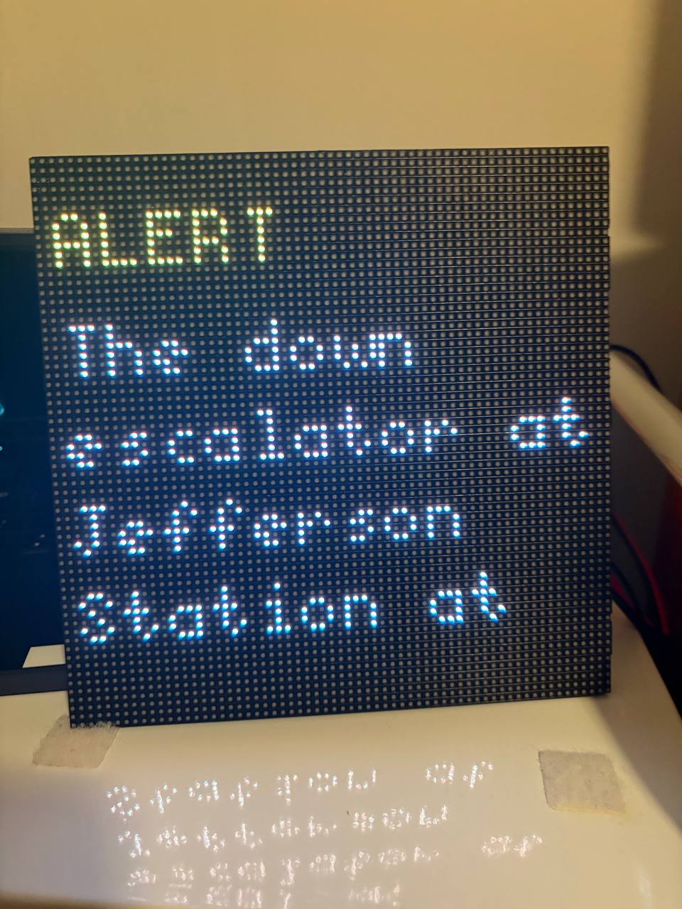

# PhillyTrains – SEPTA LED Matrix Display

This project uses a Raspberry Pi and RGB LED matrix to show live SEPTA Regional Rail information for a selected origin and destination.
It pulls data from SEPTA’s public APIs and displays upcoming trains, delays, and service alerts in a rotating format.

See **[SETUP.md](./setup.md)** for instructions on installing dependencies and configuring the board.

---

## Preview

  
  
  
  

  <em>Slide 1: SEPTA Logo • Slide 2–3: Train View • Slide 4: Alert View</em>

## Overview

The project combines:

* A **Raspberry Pi** running Python scripts to collect and process real-time train data.
* An **RGB LED matrix** that displays train schedules and alerts.
* SEPTA’s **Next To Arrive** and **GTFS Realtime** feeds for live updates.

Once powered on, the display:

1. Fetches current train schedules and delay data from SEPTA.
2. Shows the next few departures between the configured stations.
3. Rotates through service alerts and updates automatically every few minutes.

The board runs after boot, no manual refresh or interaction required.

---

## Hardware

All components are off-the-shelf and easy to find.
Here are the main parts used:

* **Raspberry Pi 3 Model B+**
* [**Adafruit RGB Matrix Bonnet**](https://www.adafruit.com/product/3211)
* [**64x64 RGB LED Matrix - 3mm Pitch - 192mm x 192mm**](https://www.adafruit.com/product/4732)
* [**5 V 4 A power supply**](https://www.adafruit.com/product/1466)

Refer to [this guide](https://learn.adafruit.com/adafruit-rgb-matrix-bonnet-for-raspberry-pi/overview) for help setting up the LED matrix.

---

## Data Sources

This project uses open data from SEPTA:

* **Next To Arrive API:** [https://www3.septa.org/api/NextToArrive/](https://www3.septa.org/api/NextToArrive/)
* **GTFS Realtime Service Alerts:** [https://www3.septa.org/gtfsrt/septarail-pa-us/Service/rtServiceAlerts.pb](https://www3.septa.org/gtfsrt/septarail-pa-us/Service/rtServiceAlerts.pb)
* **Static GTFS Schedule Data:** [https://www3.septa.org/developer/gtfs_public.zip](https://www3.septa.org/developer/gtfs_public.zip)

---

## How It Works

* **`fetch_data.py`** collects current train and alert data from SEPTA’s APIs.
* **`matrix_control.py`** renders that data on the LED matrix in a continuous slideshow loop.
* **`config.yaml`** defines station names, display brightness, and refresh timing.
* The system starts automatically on boot.

---

## Credits

Built using:

* [hzeller/rpi-rgb-led-matrix](https://github.com/hzeller/rpi-rgb-led-matrix) for LED control

* [SEPTA Developer Program](https://www3.septa.org/developer/) for transit data

